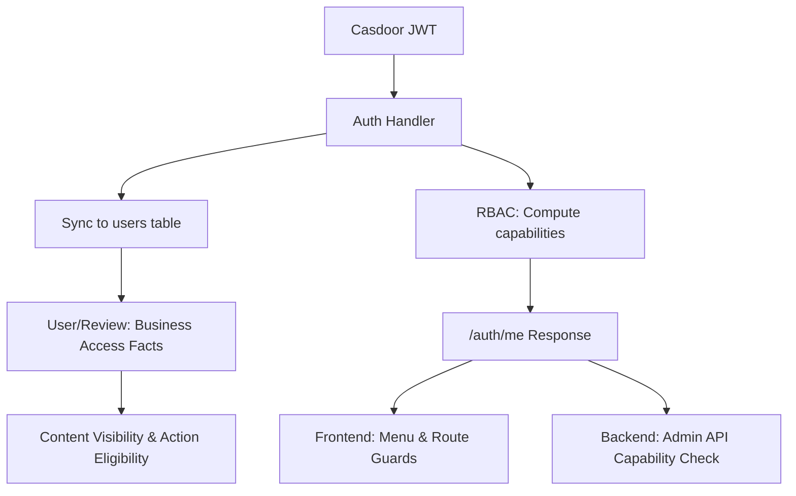

# Identity and Authorization Boundaries

The system separates identity, sessions, application capabilities, and content access control into four distinct layers, each with clear entry points.

## Layers

| Layer | Code Entry Points | Purpose |
| --- | --- | --- |
| **Identity Layer** | `server/internal/pkg/sso` | Interface with Casdoor for OAuth flow, token exchange, JWT parsing |
| **Session Layer** | `server/internal/pkg/token`, `server/internal/pkg/middleware/auth.go` | Manage access tokens, refresh tokens, cookies, and token blacklist |
| **Application Authorization** | `server/internal/modules/rbac`, `clients/shared/src/constants/capabilities.ts` | Compute capabilities to control admin access and admin actions |
| **Content Access Control** | `server/internal/modules/user`, `server/internal/modules/course/review/access.go` | Combine school, verification status, content ownership to determine visibility and action eligibility |

## Key Concepts

### Capabilities

**Capabilities** are permission strings (e.g., `admin:reviews:manage`) that grant access to specific backend features. They are computed from:

- User roles (`user_roles`)
- User group memberships (`user_group_members`, `user_group_permissions`)
- User-specific permission overrides (`user_permissions`)

Example capabilities:

```typescript
[
  'admin:dashboard:view',
  'admin:reviews:manage',
  'admin:reports:manage',
  'admin:teachers:manage',
  'user:identities:review',
  'rbac:roles:manage'
]
```

### Access Facts

**Access Facts** are business conditions used to determine content visibility and action eligibility:

| Fact | Source | Usage |
| --- | --- | --- |
| `studentVerified` | `user_profiles.student_verified` | Full review content visibility |
| `identityVerified` | `user_identities.status` / `user_profiles.identity_verified` | Publishing eligibility, verification flow |
| `schoolID` | `user_profiles.school_id` | School-scoped content filtering |
| `canManageReviews` | Capability check | Hidden content visibility, admin moderation view |

### Platform Admin

`isPlatformAdmin` is a boolean flag from Casdoor indicating the user is a platform administrator. This is separate from application-level capabilities and is used for ecosystem-level operations.

## Data Flow



## Division of Responsibilities

### Casdoor (SSO Provider)

Casdoor provides:

- Login entry point
- OAuth authorization code exchange
- User basic profile
- Platform admin flag

The `isPlatformAdmin` field enters the application with user profile data and maintains platform administrator semantics.

### StuHelper Backend

The backend:

- Syncs local users during login callback and `/auth/me`
- Computes `capabilities` from local RBAC tables
- Uses capabilities for admin routes, admin pages, and admin actions

### Business Modules

Course review, user system, and other modules combine access facts beyond capabilities:

- `studentVerified` - Full review content visibility
- `identityVerified` - Publishing eligibility
- `schoolID` - School-scoped filtering
- Content ownership - Edit/delete permissions
- `canManageReviews` - Admin moderation view

These facts directly determine review visibility, publishing eligibility, admin moderation view, and resource operation permissions.

## API Behavior

| Endpoint | Purpose |
| --- | --- |
| `/api/v1/auth/login` | Generate login redirect URL and `state` |
| `/api/v1/auth/callback` | Exchange code for Cookie session, return `UserInfo` |
| `/api/v1/auth/me` | Return current user, `capabilities`, `canAccessAdmin`, `isPlatformAdmin` |
| `/api/v1/admin/*` | All admin endpoints check capabilities |
| `/api/v1/course/review/*` | Use access facts and ownership checks beyond capabilities |

## Authorization Decision Flow

```text
1. Cookie session validation
2. Casdoor token parsing
3. Local user sync
4. Capability computation
5. Business access fact evaluation
6. Resource ownership / status check
7. Response content shaping
```

## Example: Review Visibility

```go
// In review service
func (s *Service) GetReview(ctx context.Context, reviewID string, userID *string) (*Review, error) {
    review, err := s.repo.GetReview(ctx, reviewID)
    if err != nil {
        return nil, err
    }

    // Check access facts
    accessFacts := s.getAccessFacts(ctx, userID)

    // Apply content filtering based on access facts
    if review.Status == "hidden" && !accessFacts.CanManageReviews {
        return nil, ErrReviewNotFound
    }

    if !accessFacts.StudentVerified {
        // Truncate content for non-verified students
        review.Content = truncateContent(review.Content)
    }

    return review, nil
}
```

## Example: Admin Action Check

```go
// In RBAC middleware
func (m *Middleware) RequireCapability(capability string) gin.HandlerFunc {
    return func(c *gin.Context) {
        userID := c.GetString("userID")

        capabilities, err := m.rbacService.GetUserCapabilities(c.Request.Context(), userID)
        if err != nil {
            response.Error(c, err)
            c.Abort()
            return
        }

        if !contains(capabilities, capability) {
            response.Error(c, ErrPermissionDenied)
            c.Abort()
            return
        }

        c.Next()
    }
}
```

## Related Documentation

- [Authorization Model](../modules/policy/01-authorization-model.md)
- [Policy Evaluation Order](../modules/policy/02-policy-evaluation.md)
- [RBAC Module](../modules/rbac/README.md)
- [User System Module](../modules/user-system/README.md)
