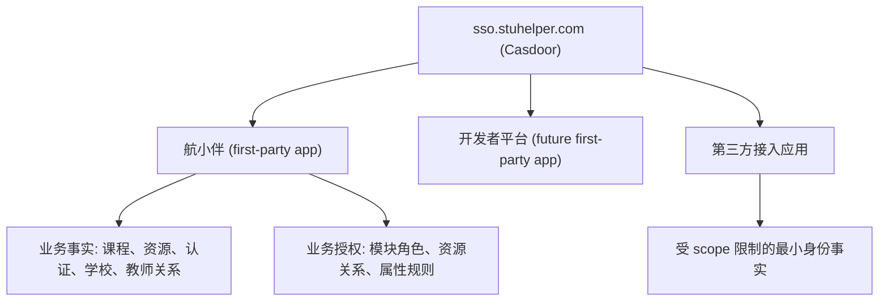

# StuHelper 生态身份与授权架构

这份文档定义 StuHelper 生态中 `sso.stuhelper.com`、航小伴、未来开发者平台和第三方接入应用之间的身份与授权边界。

它回答两个核心问题：

1. 谁负责“证明用户是谁”
2. 谁负责“决定用户在某个具体业务里能做什么”

## 一句话结论

- `sso.stuhelper.com` 负责统一身份、应用接入、OAuth/OIDC、平台级管理。
- 航小伴负责业务授权、资源级委派、学校/学生/老师/认证状态相关的规则。
- 第三方应用通过 scope 获取最小必要身份事实，不直接继承航小伴的业务权限。
- 对于课程、分类、内容所有者、任课教师这类高基数关系，推荐长期落到关系授权模型，首选 OpenFGA / SpiceDB 这类 Zanzibar 风格引擎。

还有一条必须固定下来。StuHelper 是生态，不是单一应用。Casdoor 里不应该存在一个叫 StuHelper、承载所有业务权限的大总应用。真正的应用应该各自注册，例如 `hangxiaoban`、`developer-portal` 和未来第三方应用。

## 生态分层

## 1. Casdoor 的职责

Casdoor 是整个生态的 **Identity Provider**，不是航小伴业务权限的最终真相源。

Casdoor 负责：

- 登录、注册、单点登录
- OAuth/OIDC 应用接入
- 回调地址、client、scope、consent 管理
- 平台级管理员身份
- 向应用发放 token / claims
- 对第三方应用暴露最小化身份事实的授权入口

Casdoor 官方能力本身足够强。它支持基于 Casbin model 的 ACL、RBAC、ABAC 和 RESTful access control，也支持在 `JWT-Custom` 里发出 `roles`、`groups`、`permissions` 这些 claim。

但这不等于应该把航小伴的所有业务授权都堆进 Casdoor。平台能力够强，只代表它可以做，不代表它是业务上最合适的真相源。

Casdoor 不应该直接承载这些航小伴业务概念：

- 某门课程的管理员
- 某门课程里只维护资料或课程简介的管理员
- 某分类资源管理员
- 某条评课或资源的 owner
- 任课教师默认维护自己课程资料
- `schoolID=10006`、学生/老师、实名认证/学生认证等组合业务规则

这些都属于应用业务域。

## 2. 航小伴的职责

航小伴是 StuHelper 生态中的一个业务应用。

航小伴负责：

- 业务事实的存储与计算
- 业务授权的最终决策
- 内容展示策略，例如完整展示、部分展示、带风险标签展示
- 资源级和关系级委派

这里的“业务事实”包括：

- 学校 ID
- 学生 / 老师身份
- 实名认证状态
- 学生认证状态
- 课程归属
- 任课教师关系
- 课程管理员、分类管理员、内容所有者

## 3. `isAdmin` 的正确含义

`isAdmin` 是 Casdoor / SSO 平台侧的管理员标记。

它适合表达：

- 这个账号是否具备 `sso.stuhelper.com` 平台管理能力
- 是否属于平台级运维或身份管理人员

它不应该直接表达：

- 航小伴管理员
- 评课社区管理员
- 资源共享管理员
- 某门课程或某分类的管理员

结论很简单：**不要再用 `isAdmin` 作为航小伴后台总开关。**

## 4. 最推荐的授权模型

航小伴的权限需求不是单一 RBAC，而是三种模型叠加：

### 4.1 RBAC：模块级或应用级角色

适合：

- 航小伴全局管理员
- 评课社区全局管理员
- 资源共享全局管理员

### 4.2 ReBAC：资源关系授权

适合：

- 某门课程的管理员
- 某门课程的资料管理员 / 简介管理员 / 评价管理员
- 某分类资源管理员
- 某条内容的所有者
- 某门课程的任课教师

### 4.3 ABAC：基于属性和状态的规则

适合：

- `schoolID = 10006`
- 只允许学生发评课
- 已学生认证才能查看完整信息
- 已实名认证且已学生认证才能发布
- 未认证用户内容打上风险标签

## 5. 为什么不建议把所有权限都放进 Casdoor

Casdoor 的权限模型和 Casbin `model + permission + domain` 机制足够强，可以表达很多规则。

但对航小伴来说，把所有业务授权都放进 Casdoor 会遇到三个现实问题：

1. **资源关系数量太大**
   - 课程很多
   - 分类很多
   - 内容很多
   - owner、teacher、course-manager 关系会持续增长

2. **业务状态来自应用数据库**
   - 学生认证
   - 实名认证
   - 任课教师关系
   - 课程归属
   - 这些不是 SSO 平台天然事实

3. **不同应用语义会污染**
   - “课程资料管理员”“评课版主”只对航小伴有意义
   - 不应该上升成整个生态身份平台的核心概念

所以最佳实践不是“把所有权限搬到 Casdoor”，而是：

- Casdoor 管理身份和应用接入
- 航小伴管理业务授权

## 6. 推荐的最终架构

### 6.1 平台层

- `sso.stuhelper.com` 使用 Casdoor
- 每个实际应用单独注册为一个 Casdoor Application
  - `hangxiaoban`
  - `developer-portal`
  - 未来其他 first-party / third-party 应用

### 6.2 应用授权层

航小伴内部建立统一授权服务，输入包括：

- 当前用户身份
- 课程 / 资源 / 分类 / 内容关系
- 学校、身份、认证状态等业务事实

输出包括：

- allow
- deny
- partial（部分可见）
- allow with warning（允许但带认证风险标签）

### 6.3 关系引擎

如果课程管理员、分类管理员、owner、teacher-of-course 这类规则继续扩大，推荐直接引入：

- OpenFGA
- 或 SpiceDB

这类引擎专门解决：

- many-to-many 资源委派
- 关系继承
- 高基数授权关系
- 可审计、可测试的授权图

## 7. 你提出的场景怎么落地

| 场景 | 最佳归属 |
| --- | --- |
| StuHelper 全生态管理员 | Casdoor 平台管理员，但不要用 built-in 账号做日常操作 |
| 航小伴全局管理员 | 航小伴应用级角色 |
| 评课社区全局管理员 | 航小伴模块级角色 |
| 某门课程全内容管理员 | 课程级关系授权 |
| 某门课程指定内容管理员 | 课程子资源关系授权 |
| 资源共享模块全局管理员 | 航小伴模块级角色 |
| 指定分类 / 指定课程资源管理员 | 分类级 / 课程级关系授权 |
| 成员管理自己发布内容 | owner 关系 |
| 任课教师默认维护自己课程简介和资料 | teacher-of-course 派生关系 |
| `schoolID=10006` + 学生 / 认证状态控制查看和发布 | 航小伴属性授权与内容策略 |
| 第三方应用获取认证状态 / 学校 / 身份类型 | Casdoor scope + StuHelper 最小事实接口 |

## 8. 对第三方应用开放什么

第三方应用可以通过 StuHelper SSO 获取最小必要身份事实，例如：

- `identityVerified`
- `studentVerified`
- `actorType`
- `schoolID`

默认不返回：

- 姓名
- 学号
- 证件号
- 手机号

这类数据必须通过：

- 明确 scope
- 应用审核
- 最小化字段返回

## 9. 平台管理员与 built-in 账号

Casdoor built-in 超级账号只用于：

- 初始化部署
- 救援场景
- 平台被锁死时的 break-glass 访问

日常运维不应直接使用 built-in 账号。  
应该使用普通账号 + 平台管理员角色 / 组。

## 10. 设计原则

1. 统一身份，不统一业务授权
2. 业务权限按应用边界隔离
3. 平台管理员不等于业务管理员
4. 用角色做粗粒度管理，用关系做资源授权，用属性做条件控制
5. 第三方应用只拿最小必要事实，不拿高敏感原始数据
