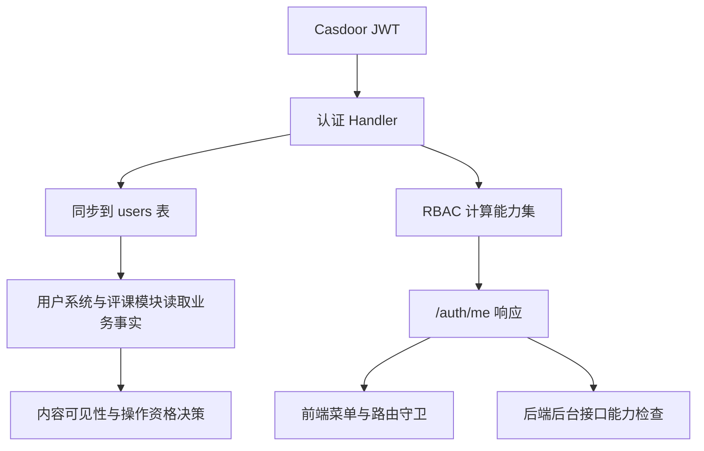

# 身份与授权边界

系统把身份、会话、应用能力和内容访问控制拆成四层，每层都有明确入口，不混用。

## 四层结构

| 层级           | 代码入口                                                                          | 用途                                                           |
| -------------- | --------------------------------------------------------------------------------- | -------------------------------------------------------------- |
| 身份层         | `server/internal/pkg/sso`                                                         | 对接 Casdoor 的 OAuth 流程、令牌交换、JWT 解析                 |
| 会话层         | `server/internal/pkg/token`、`server/internal/pkg/middleware/auth.go`             | 管理 access token、refresh token、Cookie 和黑名单              |
| 应用授权层     | `server/internal/modules/rbac`、`clients/shared/src/constants/capabilities.ts`    | 计算能力集，用于后台入口和后台操作控制                         |
| 内容访问控制层 | `server/internal/modules/user`、`server/internal/modules/course/review/access.go` | 组合学校、认证状态、内容所有权等业务事实，决定可见性和操作资格 |

## 核心概念

### 能力

能力是权限字符串，比如 `admin:reviews:manage`。它决定某个后端能力是否可用，来源有三类：

- `user_roles`
- `user_group_members` 与 `user_group_permissions`
- `user_permissions`

典型能力示例：

```typescript
[
	"admin:dashboard:view",
	"admin:reviews:manage",
	"admin:reports:manage",
	"admin:teachers:manage",
	"user:identity:review",
	"rbac:role:update",
];
```

### 访问事实

访问事实是业务条件，不等于 RBAC 能力。它们直接参与内容裁剪和资格判断。

| 事实               | 来源                                               | 用途                     |
| ------------------ | -------------------------------------------------- | ------------------------ |
| `studentVerified`  | `user_profiles.verification_status` 加学校访问策略 | 评课完整内容可见性       |
| `identityVerified` | `user_identities.verified`                         | 发布评课资格             |
| `schoolID`         | `user_profiles.school_id`                          | 学校范围控制             |
| `canManageReviews` | 能力检查                                           | 隐藏内容可见性、管理视图 |

### 平台管理员

`isPlatformAdmin` 来自 Casdoor，表示平台级管理员身份。它不是航小伴业务管理员，也不能代替应用能力。

## 数据流



## 职责边界

### Casdoor 负责什么

Casdoor 负责：

- 登录入口
- OAuth 授权码交换
- 基础用户资料
- 平台管理员标记

`isPlatformAdmin` 会随着用户资料进入应用，但只保留平台管理员语义。

### StuHelper 后端负责什么

后端负责：

- 在登录回调和 `/auth/me` 时同步本地用户
- 从本地 RBAC 表计算 `capabilities`
- 用能力保护后台路由、后台页面和后台动作

### 业务模块负责什么

评课、用户系统等业务模块会在能力之外继续组合访问事实：

- `studentVerified`
- `identityVerified`
- `schoolID`
- 内容所有权
- `canManageReviews`

这些事实共同决定评课可见性、发帖资格、管理视图和资源操作资格。

## API 行为

| 端点                      | 用途                                                              |
| ------------------------- | ----------------------------------------------------------------- |
| `/api/v1/auth/login`      | 生成登录跳转地址和 `state`                                        |
| `/api/v1/auth/callback`   | 用授权码换取 Cookie 会话并返回 `UserInfo`                         |
| `/api/v1/auth/me`         | 返回当前用户、`capabilities`、`canAccessAdmin`、`isPlatformAdmin` |
| `/api/v1/admin/*`         | 所有后台接口都按能力做检查                                        |
| `/api/v1/course/review/*` | 在能力之外继续做访问事实和所有权校验                              |

## 授权决策顺序

```text
1. 校验 Cookie 会话
2. 解析 Casdoor token
3. 同步本地用户
4. 计算能力集
5. 计算业务访问事实
6. 检查资源所有权和状态
7. 裁剪返回内容
```

## 例子

### 评课可见性

评课模块不会只看是否登录。它会继续判断学生认证、实名认证、学校是否命中允许列表，以及是否具备管理能力，再决定返回完整内容、预览内容还是空内容。

### 后台动作

后台动作统一从本地能力集判断，不依赖 Casdoor 的 `isAdmin`。前端菜单、路由守卫和后端中间件都围绕同一组能力常量工作。

## 相关文档

- [授权模型](../modules/policy/01-authorization-model.md)
- [授权决策流程](../modules/policy/02-policy-evaluation.md)
- [RBAC 模块](../modules/rbac/README.md)
- [用户系统模块](../modules/user-system/README.md)
