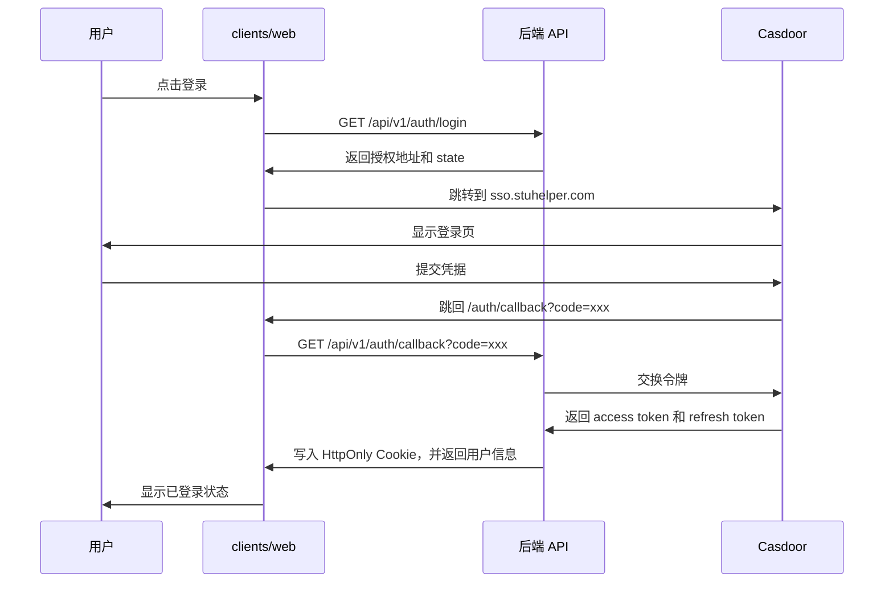

# 前端架构

前端工作区当前有四个包，分别负责主站、独立后台、共享契约和实验性的跨端入口。它们都围绕同一套 `/api/v1` 后端服务协作。

## 包结构

| 包                | 用途                                                           |
| ----------------- | -------------------------------------------------------------- |
| `clients/web`     | 主站 Web SPA，承载首页、课程、教师、评课、用户中心和嵌入式后台 |
| `clients/admin`   | 独立管理后台，负责评课管理、用户系统和 RBAC 管理               |
| `clients/shared`  | OpenAPI 生成类型、共享 API 包装、能力常量                      |
| `clients/uniappx` | 实验性的跨端包                                                 |

大多数功能改动都会碰到 `clients/web` 或 `clients/admin`，再加上 `clients/shared`。

## 路由结构

### `clients/web`

主站路由集中在 `clients/web/src/router/index.ts`。当前主要页面有：

- `/` 首页
- `/course` 课程列表
- `/review` 评课列表
- `/courses/:id` 课程详情
- `/teachers/:id` 教师详情
- `/user/*` 用户中心
- `/admin/*` 嵌入式后台

### `clients/admin`

独立后台路由集中在 `clients/admin/src/router/index.ts`。部署基路径是 `/admin`。菜单、路由守卫和按钮可见性都依赖 `requiredCapabilities`。

## 登录链路

前端通过 Cookie 会话访问后端。登录入口由 `clients/web` 发起：



前端持久化登录状态主要来自：

- `/api/v1/auth/me`
- `capabilities`
- `canAccessAdmin`
- `isPlatformAdmin`

## 共享契约

| 位置                                  | 用途               |
| ------------------------------------- | ------------------ |
| `server/api/openapi.yaml`             | 契约源文件         |
| `server/internal/api/gen/`            | 后端生成代码       |
| `clients/shared/src/types/api.gen.ts` | 前端传输层类型     |
| `clients/shared/src/api/`             | 共享 API 客户端    |
| `clients/shared/src/constants/`       | 能力常量和跨端常量 |

## API 客户端结构

```text
OpenAPI 规范（server/api/openapi.yaml）
    ↓
    ├─→ 后端：server/internal/api/gen/（Go 类型）
    └─→ 前端：clients/shared/src/types/api.gen.ts（TypeScript 类型）
            ↓
        clients/shared/src/api/client.ts（openapi-fetch 包装）
            ↓
            ├─→ clients/web/src/api/client.ts（浏览器 Cookie、CSRF、refresh）
            └─→ clients/admin/src/api/（后台侧包装）
```

## 后台入口

仓库里有两个后台入口：

- `clients/web` 里的嵌入式后台页面
- `clients/admin` 的独立后台

两者共用同一套能力集和用户契约，但页面骨架、菜单和部署方式各自独立。

## 状态管理

| 状态类型           | 当前方案                              |
| ------------------ | ------------------------------------- |
| 服务端状态         | 通过 `openapi-fetch` 发请求获取       |
| 本地组件状态       | Vue `ref` / `reactive`                |
| 跨页面共享 UI 状态 | Composable，例如 `useAuth`、`useUser` |
| 表单状态           | 组件内本地状态                        |

当前没有引入全局状态库。只有确实跨路由共享的状态，才上收进 store 或 composable。

## 类型安全

当前前端的类型链路是：

- OpenAPI 生成传输层类型
- `clients/shared` 提供共享 API 和业务常量
- `web` / `admin` 在页面里直接消费共享类型

不要在页面里再手抄一套接口类型。字段有变动时，应优先改 OpenAPI，然后重新生成。

## 开发命令

```bash
cd clients
pnpm install

# 开发
pnpm dev:web
pnpm dev:admin

# 校验
pnpm type-check
pnpm lint

# 测试
pnpm test:web
pnpm test:e2e:web

# 构建
pnpm build:web
pnpm build:admin
```

## 相关文档

- [前端开发指南](../guides/frontend-development.md)
- [OpenAPI 开发指南](../guides/openapi-development-guide.md)
