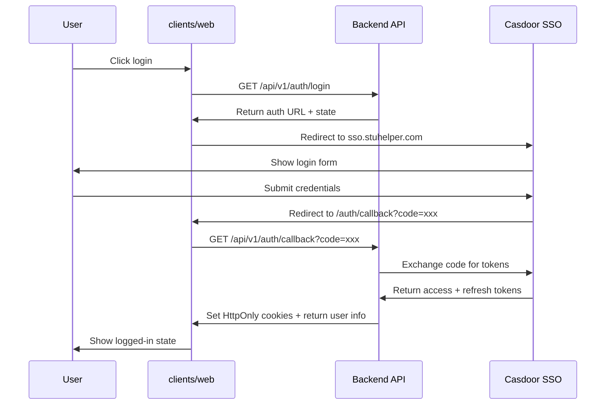

# Frontend Architecture

The frontend workspace consists of four packages: main app, admin console, shared contracts, and experimental cross-platform client. All collaborate around the same `/api/v1` backend service.

## Package Structure

| Package | Purpose |
| --- | --- |
| `clients/web` | Main web SPA hosting homepage, courses, teachers, reviews, user center, and embedded admin |
| `clients/admin` | Independent admin console for review management, user system, and RBAC management |
| `clients/shared` | OpenAPI-generated types, shared API wrappers, capability constants |
| `clients/uniappx` | Experimental cross-platform package |

## Routing Structure

### `clients/web`

Main app routes are centralized in `clients/web/src/router/index.ts`. Core pages include:

- `/` - Homepage
- `/course` - Course list
- `/review` - Review list
- `/courses/:id` - Course details
- `/teachers/:id` - Teacher details
- `/user/*` - User center
- `/admin/*` - Embedded admin

### `clients/admin`

Admin console routes are centralized in `clients/admin/src/router/index.ts`. The deployment base path is `/admin`. Menus, route guards, and button visibility all read `requiredCapabilities`.

## Authentication Flow

Frontend accesses backend via Cookie sessions. Login flow initiated by `clients/web`:



Frontend persistent auth state comes from:

- `/api/v1/auth/me` response
- `capabilities` array
- `canAccessAdmin` boolean
- `isPlatformAdmin` boolean

## Shared Contracts

| Location | Purpose |
| --- | --- |
| `server/api/openapi.yaml` | Contract source file |
| `server/internal/api/gen/` | Go-side generated code |
| `clients/shared/src/types/api.gen.ts` | Frontend transport types |
| `clients/shared/src/api/` | Shared API client |
| `clients/shared/src/constants/` | Capability and cross-platform constants |

## API Client Architecture

```text
OpenAPI Spec (server/api/openapi.yaml)
    ↓
    ├─→ Backend: server/internal/api/gen/ (Go types)
    └─→ Frontend: clients/shared/src/types/api.gen.ts (TypeScript types)
            ↓
        clients/shared/src/api/client.ts (openapi-fetch wrapper)
            ↓
            ├─→ clients/web/src/api/client.ts (Browser: Cookie, CSRF, refresh)
            └─→ clients/admin/src/api/ (Admin-specific wrappers)
```

## Admin Entry Points

The repository maintains two admin entry points:

- `clients/web` embedded admin pages
- `clients/admin` independent admin console

Both share the same capability set and user contract. Page skeletons and menus are maintained separately.

## State Management

| State Type | Solution |
| --- | --- |
| Server state | API calls via `openapi-fetch` |
| Local component state | Vue `ref` / `reactive` |
| Shared UI state | Composables (e.g., `useAuth`, `useUser`) |
| Form state | Local component state |

No global state management library (Vuex/Pinia) is used. State is kept local unless truly shared across routes.

## Type Safety

```typescript
// Generated types from OpenAPI
import type { components } from '@/types/api.gen'

type Review = components['schemas']['Review']
type CreateReviewRequest = components['schemas']['CreateReviewRequest']

// API client with full type inference
import { api } from '@/api'

const { data, error } = await api.course.review.createReview({
  body: {
    courseID: '123',
    content: 'Great course!',
    ratings: { overall: 5 }
  }
})

if (error) {
  // error is typed
  console.error(error.code, error.message)
} else {
  // data is typed as Review
  console.log(data.id, data.content)
}
```

## Build and Development

```bash
# Install dependencies
cd clients
pnpm install

# Development
pnpm dev:web      # Main app on :3000
pnpm dev:admin    # Admin console on :3001

# Type checking
pnpm type-check

# Linting
pnpm lint

# Testing
pnpm test:web
pnpm test:e2e:web

# Build
pnpm build:web
pnpm build:admin
```

## Related Documentation

- [Frontend Development Guide](../guides/frontend-development.md)
- [OpenAPI Development Guide](../guides/openapi-development-guide.md)
- [Frontend Guidelines](.trellis/spec/frontend/index.md)
