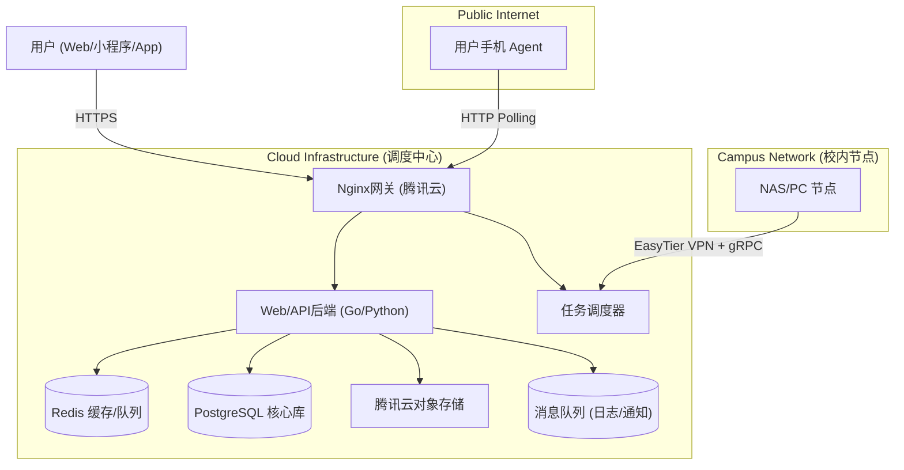

# StuHelper 系统架构设计

> 产品定位与核心能力详见 [产品介绍](../product/overview.md)

---

## 1. 系统架构设计 (System Architecture)

采用 **"调度中心 (Dispatcher) + 分布式执行节点 (Agent)"** 的混合架构。

### 1.1 网络拓扑

| 节点类型         | 部署环境       | 网络接入方式          | 通信协议              | 角色定位                              |
| :--------------- | :------------- | :-------------------- | :-------------------- | :------------------------------------ |
| **调度中心**     | 腾讯云 (公网)  | 公网 IP               | gRPC Server, HTTP API | **大脑**：任务调度、数据存储、Web服务 |
| **固定节点**     | 校内主机       | **EasyTier** 虚拟内网 | **gRPC (双向流)**     | **核心执行**：SSO模拟、爬虫、高频任务 |
| **移动节点**     | 用户手机 (App) | 公网 (Nginx反代)      | HTTPS / gRPC-Web      | **众包执行**：轻量任务、网络探测      |

### 1.2 核心组件图解

---

## 2. 技术栈选型 (Tech Stack)

基于"轻量启动、易于维护、未来可扩"的原则：

| 层级 | 技术选型 | 说明 |
|------|----------|------|
| 前端 Web | Vue3 + Element Plus | 评课社区 H5 页面 |
| 前端多端 | Uni-app (Vue3) | 小程序、App（规划中） |
| 后端 API | Go + Gin | 高性能 HTTP 服务 |
| 后端 Worker | Python + FastAPI | 爬虫、数据处理（规划中） |
| 用户认证 | Casdoor | OAuth2/OIDC 单点登录 |
| 数据库 | PostgreSQL 15+ | 关系型数据 + JSONB |
| 缓存/队列 | Redis 7+ | 会话管理、任务分发 |
| 日志分析 | PostgreSQL → ClickHouse | 初期 Unlogged Table，未来迁移 |
| 文件存储 | 腾讯云 COS | 前端直传，CDN 加速 |
| 网络组网 | EasyTier | 打通公网与校内固定节点 |
| 部署 | Docker Compose + Portainer | 单机容器编排 |
| 社群对接 | NapCat (OneBot) + Koishi | QQ Bot 框架 |

---

## 3. 数据库设计关键点 (Database Design)

### 3.1 核心表结构 (PostgreSQL)

*   **`users`**: `id`, `nickname`, `student_id` (加密), `identity_verified`, `points`.
*   **`courses`**: `id`, `code`, `name`, `teacher`, `dept_name` (支持全文检索).
*   **`resources`**: `id`, `course_id`, `file_url` (COS地址), `uploader_id`, `status` (pending/approved), `audit_log`.
*   **`logs` (日志表 - 特殊设计)**:
    *   类型：`UNLOGGED TABLE` (不写WAL，极速)。
    *   字段：`details JSONB` (存储 `{"latency_ms": 20, "node": "nas-01"}`).
    *   清理：配合 `pg_cron` 定期删除旧数据。

---

## 4. 安全与风控体系 (Security & Risk)

### 4.1 平台安全

*   **通信加密**：Agent 与调度中心间启用 TLS，且必须携带 `PSK (Pre-Shared Key)`。
*   **指令白名单**：Agent 仅执行预定义的 OpCode (如 `101:Login`, `102:Crawl`)，严禁下发 Shell 命令。
*   **内容审核**：接入腾讯云文本内容安全 API，自动过滤评论区敏感词。

### 4.2 Agent 安全增强

| 控制维度 | 措施 |
| :------- | :--- |
| **频率限制** | 单节点每分钟最大任务数、单用户每日请求上限 |
| **资源限制** | 任务执行超时、内存/CPU 使用上限 |
| **权限隔离** | 不同类型任务分配不同权限等级 |
| **日志回放** | 所有任务执行记录可追溯、可回放 |
| **离线策略** | 移动节点离线时任务自动转移至固定节点 |

### 4.3 业务合规

*   **域名防封**：主站使用 `stuhelper.com` (已备案)，避免在 QQ 内使用 `.icu` 域名。
*   **密码隐私**：SSO 登录仅在内存中转发，认证完成后立即销毁，绝不落盘。
*   **低调运行**：抢票等涉及公平性的功能，严格限制频率（Rate Limit），避免触发校方防火墙警报。

### 4.4 评课与资料风控

#### 4.4.1 反刷评机制

*   **发布限制**：同一用户对同一课程仅能发布一条评价。
*   **延迟发布**：新评价需等待 24 小时后才对外展示（便于审核）。
*   **可信度权重**：根据用户历史行为计算评价可信度，低可信度评价降权展示。
*   **异常检测**：短时间内大量相似评价触发人工审核。

#### 4.4.2 资料共享风控

*   **上传限制**：单用户每日上传数量上限，防止批量灌水。
*   **下载限制**：单用户每日下载数量上限，防止批量爬取。
*   **积分异常检测**：刷积分行为（如互刷、小号）自动冻结账号。
*   **版权保护**：支持原创标记，侵权举报优先处理。

---

## 5. 运维备忘录

*   **Agent 掉线处理**：Redis Key 过期自动摘除，前端提示“当前服务繁忙”。
*   **COS 权限**：务必使用 STS (临时密钥) 签发上传权限，不要把永久 Key 写在前端代码里。
*   **备份**：PostgreSQL 每日定时冷备，上传至 COS 冷存储。
