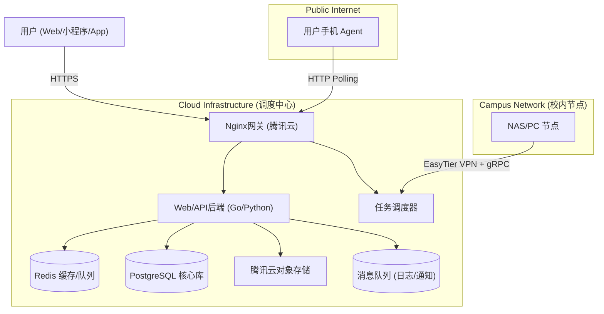

# 北航校园一站式服务系统 (BUAA StuHelper)

---

## 1. 项目概述 (Overview)

本项目旨在构建一个集**身份认证、社群管理、实用工具、学术资源共享**于一体的校园服务平台。通过统一的身份核验体系，解决QQ群反复验证痛点；通过分布式架构，突破校园网内网限制，实现高可用的一站式服务。

### 1.1 核心价值

*   **对于用户**：极简的进群体验、一站式查询教务/生活信息、匿名的评课与资料获取。
*   **对于管理者**：自动化的社群审批、基于 RBAC 的志愿者管理体系、灵活的功能策略配置。
*   **技术亮点**：采用 **"调度中心 + 分布式执行节点"** 架构，整合公网服务器与校内异构节点算力，实现高可用的混合云部署。

---

## 2. 系统架构设计 (System Architecture)

采用 **"调度中心 (Dispatcher) + 分布式执行节点 (Agent)"** 的混合架构。

### 2.1 网络拓扑

| 节点类型         | 部署环境       | 网络接入方式          | 通信协议              | 角色定位                              |
| :--------------- | :------------- | :-------------------- | :-------------------- | :------------------------------------ |
| **调度中心**     | 腾讯云 (公网)  | 公网 IP               | gRPC Server, HTTP API | **大脑**：任务调度、数据存储、Web服务 |
| **固定节点**     | 校内主机       | **EasyTier** 虚拟内网 | **gRPC (双向流)**     | **核心执行**：SSO模拟、爬虫、高频任务 |
| **移动节点**     | 用户手机 (App) | 公网 (Nginx反代)      | HTTPS / gRPC-Web      | **众包执行**：轻量任务、网络探测      |

### 2.2 核心组件图解



---

## 3. 技术栈选型 (Tech Stack)

基于“轻量启动、易于维护、未来可扩”的原则确认：

*   **前端 (多端统一)**：**Uni-app (Vue3)**
    *   *输出*：H5 (Web), 微信小程序, Android App (集成 Agent 功能)。
*   **后端 (Backend)**：**Go (高性能调度) + Python (爬虫/数据处理)**
    *   *框架*：Gin (Go) 或 FastAPI (Python)。
*   **数据库 (Database)**：
    *   **核心库**：**PostgreSQL** (关系型数据 + JSONB)。
    *   **缓存/队列**：**Redis** (会话管理、任务分发)。
    *   **日志分析**：初期使用 PostgreSQL `Unlogged Table`，未来迁移至 **ClickHouse**。
*   **文件存储**：**腾讯云 COS** (前端直传，减轻服务器带宽)。
*   **网络组网**：**EasyTier** (打通公网与校内固定节点)。
*   **运维部署**：**Docker Compose + Portainer** (单机编排，可视化管理)。
*   **社群对接**：**NapCat (OneBot)** + **Koishi** (TypeScript插件)。

---

## 4. 功能模块详解 (Functional Modules)

### 4.1 统一身份认证中心 (Unified Auth)

#### 4.1.1 认证层级

| 认证方式 | 强度 | 说明 | 适用场景 |
| :------- | :--- | :--- | :------- |
| **SSO 认证** | 强 | 通过学校 LDAP/CAS 登录验证 | 本校学生首选 |
| **数据源认证** | 中 | 学号+姓名+身份证后六位（调教务库验证） | SSO 不可用时备选 |
| **人工审核** | 弱 | 上传学生证/录取通知书，管理员后台审批 | 外校学生、特殊情况 |

#### 4.1.2 账号体系设计

*   **主认证源**：学生身份认证（学号 + 学校）为唯一主身份标识。
*   **第三方绑定**：QQ/微信为辅助登录方式，绑定后可快捷登录。
*   **多校支持**：通过 `school_id` 区分不同学校的学生，支持未来多校扩展。
*   **绑定规则**：
    *   一个学生身份只能绑定一个 QQ、一个微信。
    *   解绑需人工审核或等待冷却期（防止账号交易）。
*   **安全要求**：**严禁明文存储密码**，密码必须使用带随机盐的单向哈希存储（如 bcrypt/Argon2 等），不得使用可逆加密；其他敏感字段（身份证、手机号）采用 AES 等强加密算法存储，并通过专用密钥管理服务（KMS）进行密钥托管与定期轮换，限制少量后端服务按最小权限访问解密接口，必要时配合脱敏/分片存储减少密钥泄露影响。

### 4.2 社群自动化管理 (Community Ops)

*   **QQ群审批**：
    *   用户在系统认证 -> 获取 Token/绑定QQ -> 申请加群 -> Bot 自动审批通过。
    *   支持外校白名单邮箱后缀（如 `@bit.edu.cn`）自动放行或人工复核。
*   **消息路由**：中转群 Bot 自动回复注册链接，特定时间段开放人工客服转发。

### 4.3 评课与资料共建社区 (Academic Hub)

*   **数据结构**：基于 `Course` (课程), `Review` (评价), `Resource` (资料)。
*   **搜索增强**：PG 安装 `zhparser`，支持“操作系统”、“CS101”等模糊搜索。
*   **资料共建**：
    *   用户上传 PDF/图片 -> **前端直传 COS** -> 后端生成待审核记录。
    *   **志愿者体系**：基于 RBAC，系级/课级志愿者在小程序端审核资料。
*   **激励机制**：上传得积分，下载扣积分（防爬虫）。

### 4.4 策略配置中心 (Policy Center)

后台可配置的功能开关与策略管理，实现"默认开不开、给谁开、什么时候开"的灵活控制。

#### 4.4.1 功能开关

| 配置项 | 说明 | 默认值 |
| :----- | :--- | :----- |
| `feature.sso_login` | SSO 登录功能 | 开启 |
| `feature.auto_punch` | 阳光打卡代打 | 关闭 |
| `feature.ticket_grab` | 校车/医院抢票 | 关闭 |
| `feature.course_sync` | 课程数据同步 | 开启 |

#### 4.4.2 访问控制

*   **白名单机制**：高风险功能（抢票、代打卡）仅对白名单用户开放。
*   **灰度发布**：新功能可按比例逐步放量（如 10% -> 50% -> 100%）。
*   **审批流程**：敏感功能申请需管理员审批，记录审批日志。

#### 4.4.3 配置存储

*   使用 Redis 缓存热配置，PostgreSQL 持久化。
*   支持配置版本管理与回滚。

### 4.5 校园实用工具箱 (Utility Tools)

*   **客户端实现 (浏览器扩展/小程序)**：
    *   一键评教（JS脚本注入）、校园卡流水可视化、空教室查询。
*   **服务端实现 (Agent)**：
    *   **定时/抢占类**：阳光打卡、TD签到、校车/医院抢票。
    *   **策略**：此类功能**定向开放**（积分兑换/内测资格），避免全量开放导致服务器被封。

### 4.6 日志与可观测性系统 (Logging & Observability)

基于消息队列的统一日志采集、存储与分析系统。

#### 4.6.1 架构分层

```
应用层 → 消息队列 (Redis Stream) → 日志消费者 → 存储层 (PG/ClickHouse) → 分析/告警
```

#### 4.6.2 日志类型

| 类型 | 说明 | 保留期 |
| :--- | :--- | :----- |
| **操作日志** | 用户行为（登录、下载、评价） | 90 天 |
| **审计日志** | 管理员操作、权限变更、审批记录 | 永久 |
| **系统日志** | Agent 心跳、任务执行、异常告警 | 30 天 |
| **安全日志** | 登录失败、异常访问、风控触发 | 180 天 |

#### 4.6.3 分析与告警

*   **实时监控**：Grafana 仪表盘展示节点健康度、任务成功率、响应延迟。
*   **告警规则**：异常登录、节点掉线、任务失败率超阈值时触发告警。
*   **任务回放**：支持按任务 ID 查询完整执行链路，便于问题排查。

### 4.7 通知中心 (Notification Center)

多渠道消息推送系统，支持用户自定义订阅与渠道偏好。

#### 4.7.1 支持渠道

| 渠道 | 优先级 | 说明 |
| :--- | :----- | :--- |
| **WebSocket** | 高 | 站内实时推送，用户在线时首选 |
| **微信服务号** | 高 | 模板消息，适合重要通知 |
| **企业微信** | 中 | 应用消息推送 |
| **PushPlus** | 中 | 第三方推送聚合服务 |
| **短信** | 低 | 仅用于验证码、紧急通知（成本高） |

#### 4.7.2 推送策略

*   **渠道降级**：优先 WebSocket → 服务号 → 企微 → PushPlus → 短信。
*   **用户订阅**：用户可选择订阅的通知类型（任务完成、审核结果、系统公告）。
*   **失败重试**：推送失败自动重试 3 次，间隔递增。
*   **模板管理**：后台可配置各类通知的消息模板。

### 4.8 举报与内容审核系统 (Report & Moderation)

针对评课社区、资料共享的完整举报与审核流程。

#### 4.8.1 举报入口

*   评课详情页、资料详情页均提供"举报"按钮。
*   举报类型：虚假信息、侵权内容、恶意刷评、人身攻击、其他。

#### 4.8.2 审核流程

```
用户举报 → 待审核队列 → 志愿者/管理员审核 → 处理决定 → 通知双方
```

#### 4.8.3 处罚机制

| 违规等级 | 处罚措施 |
| :------- | :------- |
| 轻微 | 内容删除 + 警告 |
| 一般 | 禁言 7 天 + 扣积分 |
| 严重 | 封禁账号 + 加入黑名单 |

#### 4.8.4 申诉机制

*   被处罚用户可在 7 天内提交申诉。
*   申诉由高级管理员复核，结果为最终决定。

---

## 5. 数据库设计关键点 (Database Design)

### 5.1 核心表结构 (PostgreSQL)

*   **`users`**: `id`, `nickname`, `student_id` (加密), `identity_verified`, `points`.
*   **`courses`**: `id`, `code`, `name`, `teacher`, `dept_name` (支持全文检索).
*   **`resources`**: `id`, `course_id`, `file_url` (COS地址), `uploader_id`, `status` (pending/approved), `audit_log`.
*   **`logs` (日志表 - 特殊设计)**:
    *   类型：`UNLOGGED TABLE` (不写WAL，极速)。
    *   字段：`details JSONB` (存储 `{"latency_ms": 20, "node": "nas-01"}`).
    *   清理：配合 `pg_cron` 定期删除旧数据。

---

## 6. 安全与风控体系 (Security & Risk)

### 6.1 平台安全

*   **通信加密**：Agent 与调度中心间启用 TLS，且必须携带 `PSK (Pre-Shared Key)`。
*   **指令白名单**：Agent 仅执行预定义的 OpCode (如 `101:Login`, `102:Crawl`)，严禁下发 Shell 命令。
*   **内容审核**：接入腾讯云文本内容安全 API，自动过滤评论区敏感词。

### 6.2 Agent 安全增强

| 控制维度 | 措施 |
| :------- | :--- |
| **频率限制** | 单节点每分钟最大任务数、单用户每日请求上限 |
| **资源限制** | 任务执行超时、内存/CPU 使用上限 |
| **权限隔离** | 不同类型任务分配不同权限等级 |
| **日志回放** | 所有任务执行记录可追溯、可回放 |
| **离线策略** | 移动节点离线时任务自动转移至固定节点 |

### 6.3 业务合规

*   **域名防封**：主站使用 `stuhelper.com` (已备案)，避免在 QQ 内使用 `.icu` 域名。
*   **密码隐私**：SSO 登录仅在内存中转发，认证完成后立即销毁，绝不落盘。
*   **低调运行**：抢票等涉及公平性的功能，严格限制频率（Rate Limit），避免触发校方防火墙警报。

### 6.4 评课与资料风控

#### 6.4.1 反刷评机制

*   **发布限制**：同一用户对同一课程仅能发布一条评价。
*   **延迟发布**：新评价需等待 24 小时后才对外展示（便于审核）。
*   **可信度权重**：根据用户历史行为计算评价可信度，低可信度评价降权展示。
*   **异常检测**：短时间内大量相似评价触发人工审核。

#### 6.4.2 资料共享风控

*   **上传限制**：单用户每日上传数量上限，防止批量灌水。
*   **下载限制**：单用户每日下载数量上限，防止批量爬取。
*   **积分异常检测**：刷积分行为（如互刷、小号）自动冻结账号。
*   **版权保护**：支持原创标记，侵权举报优先处理。

---

## 7. 开发与落地路线图 (Roadmap)

### 第一阶段：基建与认证 (MVP)

1.  **环境搭建**：配置腾讯云 Docker 环境，部署 Postgres, Redis, Portainer, EasyTier。
2.  **固定节点接入**：在校内 NAS 部署 Go 语言编写的 Agent，打通 EasyTier 内网穿透。
3.  **核心业务**：完成 Uni-app 注册页、SSO 模拟登录接口、QQ Bot 自动审批功能。
4.  **最小可用监控**：部署基础日志采集（Redis Stream）+ Grafana 仪表盘。
5.  **权限基础**：实现 RBAC 权限模型 + 审计日志记录。

### 第二阶段：社区与内容 (Content)

1.  **资料库上线**：开通 COS，开发资料上传、志愿者审核后台。
2.  **课程数据导入**：利用 Agent 爬虫同步教务系统课程库。
3.  **评课功能**：上线匿名评课板块，接入文本安全检测。
4.  **内容审核流程**：完善举报系统、审核队列、处罚/申诉机制。
5.  **灰度与回滚**：实现功能灰度发布能力，支持快速回滚。

### 第三阶段：移动端算力与优化 (Expansion)

1.  **App 封装**：将 Uni-app 打包为 Android APK，集成后台 WorkManager 轮询逻辑（Mobile Agent）。
2.  **日志系统**：完善基于 PG JSONB 的日志分析，监控节点健康度。
3.  **高可用调度**：完善 Dispatcher 逻辑，实现"固定节点优先，移动节点兜底"的调度策略。
4.  **通知中心**：上线多渠道推送（WebSocket/服务号/企微/PushPlus），支持用户订阅配置。
5.  **多校扩展**：抽象学校配置，支持多租户架构，为接入其他高校做准备。

---

## 8. 运维备忘录

*   **Agent 掉线处理**：Redis Key 过期自动摘除，前端提示“当前服务繁忙”。
*   **COS 权限**：务必使用 STS (临时密钥) 签发上传权限，不要把永久 Key 写在前端代码里。
*   **备份**：PostgreSQL 每日定时冷备，上传至 COS 冷存储。
