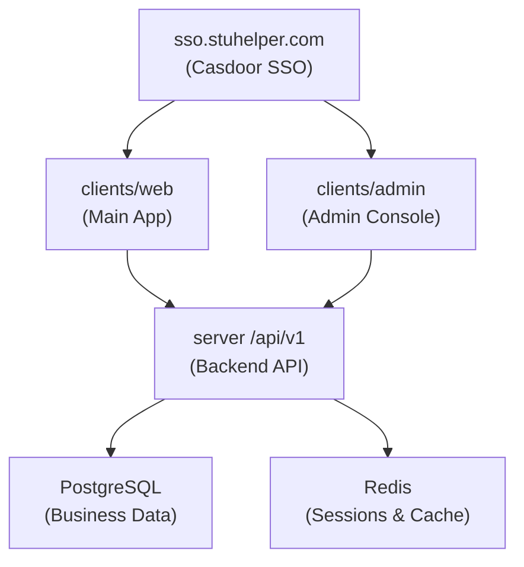

# Product Overview

StuHelper operates as a campus information and course review service, with core entry points consisting of a unified identity service, main web application, and independent admin console.

## Product Components

| Layer | Location | Purpose |
| --- | --- | --- |
| Identity Entry | `sso.stuhelper.com` | Login, registration, single sign-on, OAuth callback entry |
| Main Application | `clients/web` | Homepage, courses, teachers, reviews, user center, embedded admin |
| Admin Console | `clients/admin` | Review management, user system, RBAC management |
| Backend Service | `server/cmd/stuhelper` | `/api/v1`, health checks, metrics, documentation |

## Business Areas

| Area | Description |
| --- | --- |
| Course Entities | Departments, terms, course categories, course search, course details |
| Review Community | Post reviews, rating dimensions, replies, favorites, notifications, reports |
| User System | Identity verification, student verification, academic info, school config, system config |
| Admin Operations | Review moderation, report handling, teacher maintenance, sensitive words, role permissions |

## User Roles

| Role | Typical Scenarios |
| --- | --- |
| Anonymous User | Browse courses and teacher information, view public reviews |
| Authenticated User | View full reviews, post reviews, manage personal content |
| Verified Student | Access student-only content, post course reviews, complete user center actions |
| Admin Staff | Moderate content, handle reports, maintain configuration, manage permissions |

## System Topology

## Technology Stack

| Component | Technology |
| --- | --- |
| Frontend | Vue 3, TypeScript, Tailwind CSS, Element Plus |
| Backend | Go 1.24+, Gin, GORM |
| Database | PostgreSQL 16+ |
| Cache | Redis 7+ |
| SSO | Casdoor (OAuth 2.0 / OIDC) |
| API Contract | OpenAPI 3.1 |
