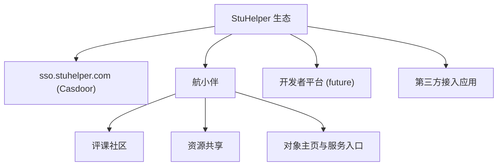

# 产品概述

## 产品定位

StuHelper 不是单一应用，而是一个校园服务生态。

当前可以拆成三层：

1. **生态基础设施**：`sso.stuhelper.com`，负责统一身份、OAuth/OIDC、应用接入
2. **first-party 应用**：例如航小伴
3. **开放平台**：未来允许其他开发者把自己的应用接入 StuHelper SSO，并按 scope 获取最小必要身份事实

航小伴是当前最核心的 first-party 应用，承载“对象主页 + 评课社区 + 资源共享”等业务。

## 生态分层

## 核心能力

### 统一身份

所有 first-party 和 third-party 应用都通过 `sso.stuhelper.com` 接入：

- 登录
- 注册
- 单点登录
- 第三方应用 OAuth 授权

### 航小伴

航小伴围绕校园对象组织内容和服务：

- **对象主页**：课程、教师、教室、校园设施等
- **评课社区**：课程评价、课程简介、教师信息
- **资源共享**：课程资料、竞赛资料、模板资源
- **对象相关通知**：后续可扩展的订阅与提醒能力

### 开放平台

未来第三方应用开发者可以：

- 接入 StuHelper SSO
- 通过受控 scope 获取用户的最小必要身份事实
- 基于 StuHelper 生态账号体系提供自己的应用服务

## 核心架构原则

### 统一身份，不统一业务授权

`sso.stuhelper.com` 负责证明“这个用户是谁”，
具体应用负责决定“这个用户在本应用里能做什么”。

### 业务权限按应用边界隔离

StuHelper 生态里可以有多个应用：

- 航小伴
- 开发者平台
- 第三方接入应用

每个应用应有自己的业务授权模型，不应把所有业务权限都压扁到 SSO 平台级管理员概念里。

### 最小化身份事实开放

对外开放给第三方应用的用户信息，默认只提供：

- 身份状态
- 学生认证状态
- 学生 / 老师身份
- 学校 ID

不直接提供高敏感原始信息。

## 目标用户

| 用户 | 场景 |
| --- | --- |
| 学生 | 评课、资料、校园对象主页、后续通知 |
| 教师 | 课程主页维护、资料维护、后续教务相关能力 |
| 运营与审核人员 | 内容审核、认证审核、资源管理 |
| 开发者 | 接入 StuHelper SSO、使用受控身份事实、构建生态应用 |
