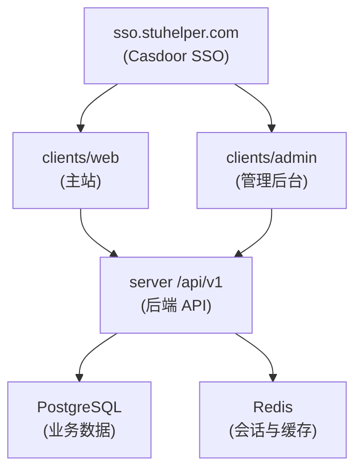

# 产品概览

StuHelper 当前是一套校园信息与评课服务，核心入口由统一身份服务、主站 Web 应用和独立管理后台组成。

## 产品组成

| 层级     | 位置                   | 用途                                           |
| -------- | ---------------------- | ---------------------------------------------- |
| 身份入口 | `sso.stuhelper.com`    | 登录、注册、单点登录、OAuth 回调入口           |
| 主应用   | `clients/web`          | 首页、课程、教师、评课、用户中心、嵌入式管理页 |
| 管理后台 | `clients/admin`        | 评课管理、用户系统、RBAC 管理                  |
| 后端服务 | `server/cmd/stuhelper` | `/api/v1`、健康检查、指标、接口文档            |

## 业务域

| 业务域   | 说明                                             |
| -------- | ------------------------------------------------ |
| 课程实体 | 院系、学期、课程分类、课程搜索、课程详情         |
| 评课社区 | 发布评课、评分维度、回复、收藏、通知、举报       |
| 用户系统 | 实名认证、学生认证、学籍信息、学校配置、系统配置 |
| 管理运营 | 评论审核、举报处理、教师维护、敏感词、角色权限   |

## 用户角色

| 角色       | 常见场景                                         |
| ---------- | ------------------------------------------------ |
| 匿名用户   | 浏览课程和教师信息，查看公开评课                 |
| 已登录用户 | 查看更多内容，管理个人内容                       |
| 已认证学生 | 访问学生可见内容，发布评课，使用完整用户中心能力 |
| 管理人员   | 审核内容、处理举报、维护配置、管理权限           |

## 系统拓扑

## 技术栈

| 组件     | 技术                                          |
| -------- | --------------------------------------------- |
| 前端     | Vue 3、TypeScript、Tailwind CSS、Element Plus |
| 后端     | Go 1.24+、Gin、pgx                            |
| 数据库   | PostgreSQL 16+                                |
| 缓存     | Redis 7+                                      |
| 统一身份 | Casdoor（OAuth 2.0 / OIDC）                   |
| API 契约 | OpenAPI 3.1                                   |
