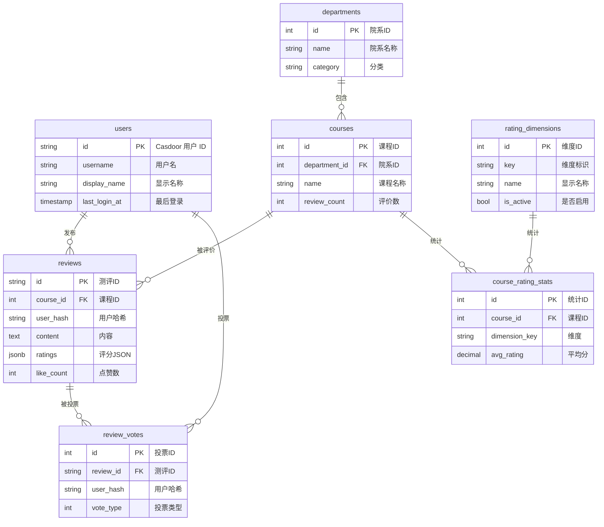

# StuHelper 数据库设计

## 概述

StuHelper 使用 Casdoor 作为用户认证系统，本地 PostgreSQL 数据库存储业务数据。

> 评课社区详细数据模型见 [modules/course/01_data_model.md](../modules/course/01_data_model.md)

## ER 图



## 表结构定义 (PostgreSQL)

> 完整表结构见 [modules/course/01_data_model.md](../modules/course/01_data_model.md)

### users 用户表

```sql
CREATE TABLE users (
    id VARCHAR(64) PRIMARY KEY,           -- Casdoor 用户 ID
    username VARCHAR(100) NOT NULL,
    display_name VARCHAR(100),
    email VARCHAR(255),
    avatar VARCHAR(500),
    created_at TIMESTAMP DEFAULT CURRENT_TIMESTAMP,
    last_login_at TIMESTAMP
);
```

### reviews 测评表

使用 JSONB 存储动态评分维度。

```sql
CREATE TABLE reviews (
    id VARCHAR(20) PRIMARY KEY,
    course_id INTEGER NOT NULL REFERENCES courses(id),
    user_hash VARCHAR(64) NOT NULL,       -- 匿名用户标识
    content TEXT NOT NULL,
    ratings JSONB NOT NULL,               -- {"overall":5,"content":4,...}
    like_count INTEGER DEFAULT 0,
    dislike_count INTEGER DEFAULT 0,
    created_at TIMESTAMP DEFAULT CURRENT_TIMESTAMP
);
```

**ratings 字段示例**：

```json
{
  "overall": 5,
  "content": 4,
  "workload": 3,
  "grading": 4,
  "attendance": 2
}
```

## 设计说明

1. **用户认证**: 由 Casdoor 管理，本地仅缓存基本信息
2. **动态评分**: 使用 JSONB 存储，支持可配置的评分维度
3. **匿名性**: 测评使用 user_hash 而非直接关联用户ID
