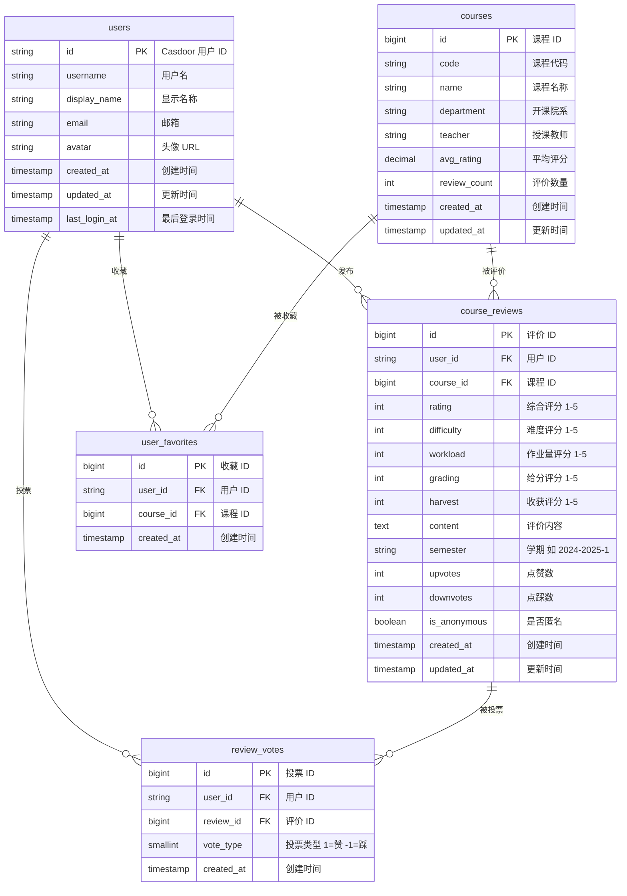

# StuHelper 数据库设计

## 概述

StuHelper 使用 Casdoor 作为用户认证和权限管理系统，本地数据库主要存储：
- 用户业务数据的本地缓存
- 与用户关联的业务数据（评论、收藏等）

## ER 图



## 表结构定义 (PostgreSQL)

### users 用户表

```sql
CREATE TABLE users (
    id VARCHAR(64) PRIMARY KEY,           -- Casdoor 用户 ID
    username VARCHAR(100) NOT NULL,       -- 用户名
    display_name VARCHAR(100),            -- 显示名称
    email VARCHAR(255),                   -- 邮箱
    avatar VARCHAR(500),                  -- 头像 URL
    created_at TIMESTAMP WITH TIME ZONE DEFAULT CURRENT_TIMESTAMP,
    updated_at TIMESTAMP WITH TIME ZONE DEFAULT CURRENT_TIMESTAMP,
    last_login_at TIMESTAMP WITH TIME ZONE,

    CONSTRAINT uk_users_username UNIQUE (username)
);

CREATE INDEX idx_users_email ON users(email);
```

### courses 课程表

```sql
CREATE TABLE courses (
    id BIGSERIAL PRIMARY KEY,
    code VARCHAR(50) NOT NULL,            -- 课程代码
    name VARCHAR(200) NOT NULL,           -- 课程名称
    department VARCHAR(100),              -- 开课院系
    teacher VARCHAR(100),                 -- 授课教师
    avg_rating DECIMAL(3,2) DEFAULT 0,    -- 平均评分
    review_count INT DEFAULT 0,           -- 评价数量
    created_at TIMESTAMP WITH TIME ZONE DEFAULT CURRENT_TIMESTAMP,
    updated_at TIMESTAMP WITH TIME ZONE DEFAULT CURRENT_TIMESTAMP,

    CONSTRAINT uk_courses_code_teacher UNIQUE (code, teacher)
);

CREATE INDEX idx_courses_department ON courses(department);
CREATE INDEX idx_courses_name ON courses(name);
```

### course_reviews 课程评价表

```sql
CREATE TABLE course_reviews (
    id BIGSERIAL PRIMARY KEY,
    user_id VARCHAR(64) NOT NULL REFERENCES users(id),
    course_id BIGINT NOT NULL REFERENCES courses(id),
    rating SMALLINT NOT NULL CHECK (rating BETWEEN 1 AND 5),
    difficulty SMALLINT CHECK (difficulty BETWEEN 1 AND 5),
    workload SMALLINT CHECK (workload BETWEEN 1 AND 5),
    grading SMALLINT CHECK (grading BETWEEN 1 AND 5),
    harvest SMALLINT CHECK (harvest BETWEEN 1 AND 5),
    content TEXT NOT NULL,
    semester VARCHAR(20),
    upvotes INT DEFAULT 0,
    downvotes INT DEFAULT 0,
    is_anonymous BOOLEAN DEFAULT FALSE,
    created_at TIMESTAMP WITH TIME ZONE DEFAULT CURRENT_TIMESTAMP,
    updated_at TIMESTAMP WITH TIME ZONE DEFAULT CURRENT_TIMESTAMP,

    CONSTRAINT uk_reviews_user_course UNIQUE (user_id, course_id)
);

CREATE INDEX idx_reviews_course_id ON course_reviews(course_id);
CREATE INDEX idx_reviews_created_at ON course_reviews(created_at DESC);
```

### review_votes 评价投票表

```sql
CREATE TABLE review_votes (
    id BIGSERIAL PRIMARY KEY,
    user_id VARCHAR(64) NOT NULL REFERENCES users(id),
    review_id BIGINT NOT NULL REFERENCES course_reviews(id) ON DELETE CASCADE,
    vote_type SMALLINT NOT NULL CHECK (vote_type IN (1, -1)),
    created_at TIMESTAMP WITH TIME ZONE DEFAULT CURRENT_TIMESTAMP,

    CONSTRAINT uk_votes_user_review UNIQUE (user_id, review_id)
);

CREATE INDEX idx_votes_review_id ON review_votes(review_id);
```

### user_favorites 用户收藏表

```sql
CREATE TABLE user_favorites (
    id BIGSERIAL PRIMARY KEY,
    user_id VARCHAR(64) NOT NULL REFERENCES users(id),
    course_id BIGINT NOT NULL REFERENCES courses(id) ON DELETE CASCADE,
    created_at TIMESTAMP WITH TIME ZONE DEFAULT CURRENT_TIMESTAMP,

    CONSTRAINT uk_favorites_user_course UNIQUE (user_id, course_id)
);

CREATE INDEX idx_favorites_user_id ON user_favorites(user_id);
```

## 设计说明

1. **用户表 (users)**
   - `id` 使用 Casdoor 的用户 ID，保持一致性
   - 用户基本信息从 Casdoor 同步，OAuth 回调时更新

2. **权限管理**
   - 角色和权限由 Casdoor 管理，不在本地存储
   - 通过 Casdoor SDK 的 `Enforce()` 方法进行权限检查

3. **数据完整性**
   - 使用外键约束保证数据一致性
   - 唯一约束防止重复数据（如一个用户只能对一门课评价一次）
