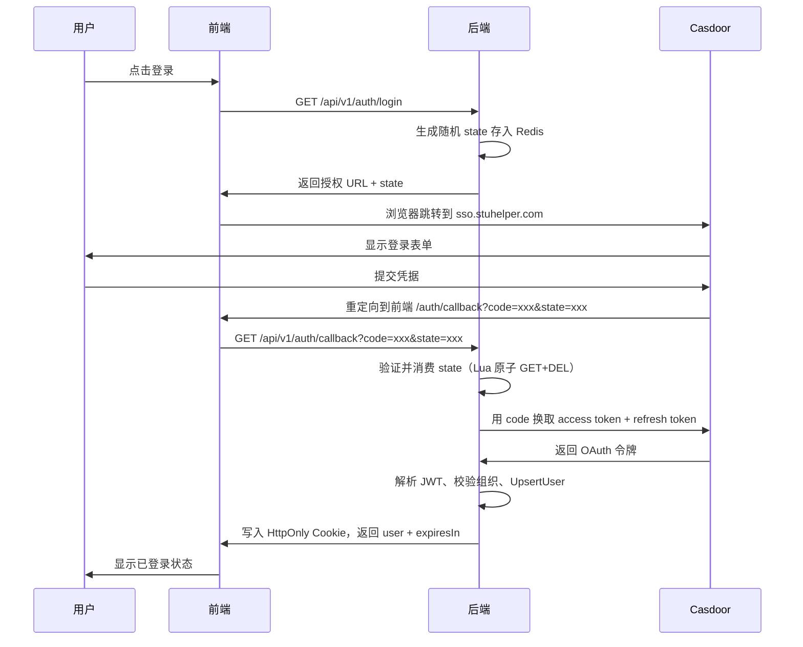

# 认证与会话模块

认证与会话模块处理 SSO 集成、会话管理、账号同步、LDAP 验证和安全存储。

## 代码范围

| 代码位置 | 职责 |
| --- | --- |
| `server/internal/modules/auth` | 登录回调、会话刷新、当前用户信息 |
| `server/internal/pkg/sso` | Casdoor OAuth 客户端（URL 生成、令牌交换、JWT 解析、用户缓存） |
| `server/internal/pkg/token` | 令牌签发、黑名单、用户令牌追踪 |
| `server/internal/modules/ldap` | LDAP 登录验证和用户信息查询 |
| `server/internal/pkg/crypto/pii` | 证件号 AES-256-GCM 加密 |

## 文档索引

| 文档 | 内容 |
| --- | --- |
| [01-casdoor-sso.md](01-casdoor-sso.md) | Casdoor 登录流程、回调、当前用户信息 |
| [02-ldap.md](02-ldap.md) | LDAP 客户端与学生认证中的 LDAP 验证 |
| [03-account.md](03-account.md) | 本地账号同步与用户标识符 |
| [04-security.md](04-security.md) | 会话、Cookie、PII 加密、审计 |

## 登录流程

## 会话管理

| 令牌类型 | 存储方式 | 有效期 | 用途 |
| --- | --- | --- | --- |
| Access Token | HttpOnly Cookie（`access_token`） | 默认 15 分钟（900 秒） | API 认证 |
| Refresh Token | HttpOnly Cookie（`refresh_token`），Path 限定为 `/api/v1/auth/refresh` | 默认 7 天（604800 秒） | 令牌刷新 |
| CSRF Token | 普通 Cookie（`csrf_token`），HttpOnly=false | 跟随 Refresh Token | CSRF 防护，前端在请求头中回传 |

## API 端点

| 端点 | 方法 | 用途 |
| --- | --- | --- |
| `/api/v1/auth/login` | GET | 生成登录跳转 URL 和 state |
| `/api/v1/auth/signup` | GET | 生成注册跳转 URL 和 state |
| `/api/v1/auth/callback` | GET | 用授权码换取会话，返回用户信息 |
| `/api/v1/auth/refresh` | POST | 刷新 access token（限流：每分钟 10 次） |
| `/api/v1/auth/me` | GET | 获取当前用户信息和能力集 |
| `/api/v1/auth/logout` | POST | 登出当前设备 |
| `/api/v1/auth/logout-all` | POST | 登出所有设备 |

## 相关文档

- [用户系统](../user-system/README.md)
- [RBAC 权限控制](../rbac/README.md)
- [授权策略](../policy/README.md)
