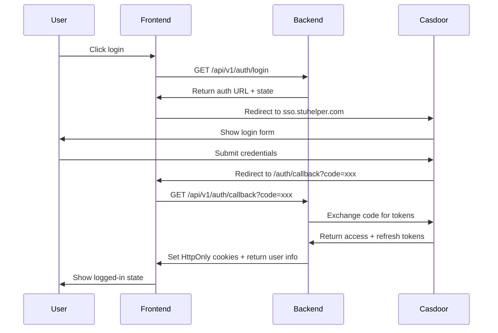

# Authentication and Sessions

This documentation covers SSO integration, session management, account synchronization, LDAP validation, and security storage.

## Code Scope

| Code Location | Purpose |
| --- | --- |
| `server/internal/modules/auth` | Login, callback, session refresh, current user info |
| `server/internal/pkg/sso` | Casdoor OAuth/OIDC client |
| `server/internal/pkg/token` | Token issuance, blacklist, session tracking |
| `server/internal/modules/ldap` | LDAP login validation and user profile query |
| `server/internal/pkg/crypto/pii` | Government ID encryption |

## Documentation Index

| Document | Description |
| --- | --- |
| [01-casdoor-sso.md](01-casdoor-sso.md) | Casdoor login flow, callback, current user info |
| [02-ldap.md](02-ldap.md) | LDAP client and LDAP validation in student verification |
| [03-account.md](03-account.md) | Local account sync and user identifiers |
| [04-security.md](04-security.md) | Sessions, cookies, PII encryption, audit |

## Quick Reference

### Login Flow

### Session Management

| Token Type | Storage | Lifetime | Purpose |
| --- | --- | --- | --- |
| Access Token | HttpOnly Cookie | 15 minutes | API authentication |
| Refresh Token | HttpOnly Cookie | 7 days | Token refresh |
| CSRF Token | Regular Cookie | Session | CSRF protection |

### API Endpoints

| Endpoint | Purpose |
| --- | --- |
| `GET /api/v1/auth/login` | Generate login redirect URL and state |
| `GET /api/v1/auth/signup` | Generate signup redirect URL and state |
| `GET /api/v1/auth/callback` | Exchange code for session, return user info |
| `POST /api/v1/auth/refresh` | Refresh access token |
| `GET /api/v1/auth/me` | Get current user info and capabilities |
| `POST /api/v1/auth/logout` | Logout current device |
| `POST /api/v1/auth/logout-all` | Logout all devices |

## Related Documentation

- [Identity and Authorization](../../architecture/ecosystem-identity-and-authorization.md)
- [User System](../user-system/README.md)
- [RBAC](../rbac/README.md)
